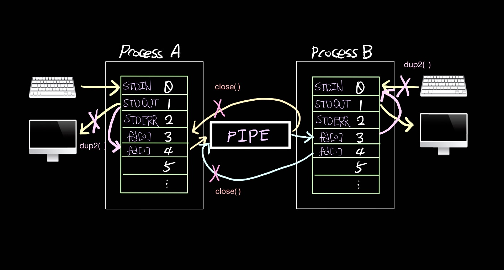

# Pipex



## Table of Contents

- [Introduction](#introduction)
- [Features](#features)
- [Bonus Features](#bonus-features)
- [Usage](#usage)
- [Examples](#examples)
- [Installation](#installation)
- [Project Structure](#project-structure)
- [Contact](#contact)

## Introduction

`Pipex` is a project from the 42 School curriculum that involves recreating the functionality of the shell's pipeline (`|`) operator. This project helps you understand how pipes work in UNIX-like systems by implementing the process of data redirection between multiple commands. The goal is to execute commands with input/output redirection in a way that simulates the behavior of a shell pipeline.

## Features

- Executes two commands connected by a pipe, redirecting the output of the first command to the input of the second.
- Handles file input and output redirection, simulating the behavior of `cat file1 | grep something > file2`.
- Supports a variety of command-line arguments to specify files and commands.
- Robust error handling and validation for file access and command execution.

### Bonus Features

In addition to the basic functionality, the bonus part of the `Pipex` project includes:

- **Handling multiple pipes**: Support for more than two commands connected by multiple pipes (e.g., `cmd1 | cmd2 | cmd3 | ... | cmdN`).
- **Heredoc**: Implementation of a "heredoc" feature, which reads input from the standard input until a delimiter is reached, simulating `<<` in the shell.

## Installation
- Clone the repository:
     ```sh
     git clone https://github.com/ERROR244/Pipex.git
     cd Pipex
     ```

- Build the project:
     ```sh
     make
     make bonus # for bonus
     ```

## Usage

To use pipex, provide an input file, commands, and an output file as arguments. The program will execute the first command with input from the input file, pipe the output to the next command, and so on, until the final output is written to the output file.

- Syntax
     ```sh
     ./pipex infile "command1" "command2" outfile
     ```

infile: The file to be used as input.\
command1: The first command to execute.\
command2: The second command to execute, with its input coming from the output of command1.\
outfile: The file to write the final output.

### Bonus Usage

- **Multiple Pipes**:
  ```sh
  ./pipex infile "cmd1" "cmd2" "cmd3" ... "cmdN" outfile
- **Heredoc**:
     ```sh
     ./pipex here_doc LIMITER "cmd1" "cmd2" outfile
     ```

## Examples
```sh
# Basic example: Executes `ls` with input from infile, pipes the output to `wc -l`, and writes the result to outfile.
./pipex infile "ls -l" "wc -l" outfile

# Simulates `cat file1 | grep something > file2`
./pipex file1 "cat" "grep something" file2

# Example with multiple pipes
./pipex infile "grep something" "sort" "uniq" outfile

# Heredoc example
./pipex here_doc LIMITER "cat" "grep something" outfile
```

## Project Structure
```css
Pipex/
├── Bonus/
│   ├── main_bonus.c                 // Bonus main logic
│   ├── pipex_bonus.h                // Bonus header file
│   ├── pipex_utils0_bonus.c         // Bonus utility functions
│   ├── pipex_utils1_bonus.c
│   ├── pipex_utils2_bonus.c
│   ├── wrapper_functions_bonus.c    // Wrapper functions for bonus
├── libft/
│   ├── *.c                          // Libft source files
│   ├── *.h                          // Libft header files
├── main.c                           // Main program logic for mandatory part
├── Makefile                         // Build instructions
├── pipex.h                          // Header file
├── pipex_utils0.c                   // Utility functions for mandatory part
├── wrapper_functions.c              // Wrapper functions for mandatory part
├── README.md                        // Project documentation
```

## Contact

khalil sohail - [khalilsohail@gmail.com](khalilsohail@gmail.com)\
Project Link: [https://github.com/ERROR244/Pipex.git](https://github.com/ERROR244/Pipex.git)